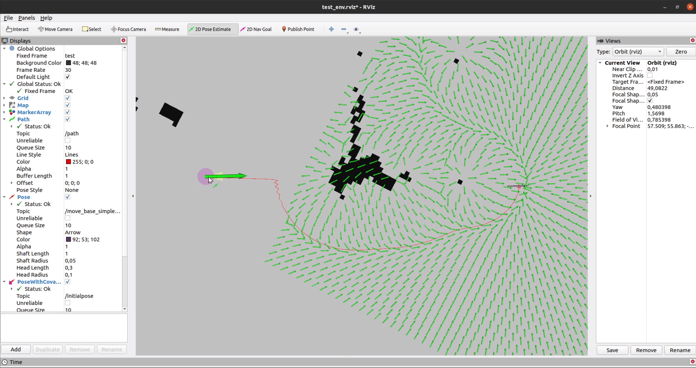

# Artificial Potential Fields 

## 1) Introduction
You can find the basic implementation of artificial potential fields path planning algorithm.
You can try hyperparameters with rqt_reconfigure node in order to see the difference of them on the fly. RViz is used for visualization.

## 2) Project Packages
* base_planner
* artificial_potential_field_planner 
## 3) Dependencies
* dynamic_reconfigure
* geometry_msgs
* nav_msgs
* gtest
* rqt_reconfigure
* rviz 
* tf
* map_server 

packages are used in this project.

## 3) Tests
### Unit tests
 There two different test scenarios. One of them has empty map 
 and the goal is reach the goal point with the max distance of resolution of the map(which is one).
 Second one is almost the same but there is a big obstacle in the middle of the map.
 It should get pass through it to the goal with the distance of, again, resolution.
 
 To run unit tests, you should first compile it with;
 
 	catkin build --catkin-make-args run_tests
 	
  After that, you run tests with;
  
  	rosrun artificial_potential_field_planner artificial_potential_field_planner_test 
 	 

 

### Real-time testing

To run real-time tests, you should first compile it with;
 
 	catkin build
 	
There are three maps in the project for real time testing. For these three maps, there also three
launch files. In order to create a fixed frame for both map and planner algorithm, static_transform_publisher
node of the tf package is used. Origin of the maps are different, so transforms should be too. 
You can start each test with 

  	roslaunch artificial_potential_field_planner apf_dummy1.launch
  	roslaunch artificial_potential_field_planner apf_dummy2.launch
  	roslaunch artificial_potential_field_planner apf_dummy3.launch
 	 
commands.

Rviz and rqt_reconfigure panel shall be opened. You can install default algorithm parameters
with rqt_reconfigure load button. There is prepared parameter set;

  	ws/src/artificial_potential_field_planner/params/parameters.yaml
 	 
Or, you can try all of the possible values by changing it from the panel. 

To see the path planning algorithm working, you should first select a pose estimation by RViz.
Then, you can set the goal pose("2D Nav Goal" button). If force field width and height is not zero, 
a force map is going to be drawn around the last reached point.
### Design
All code is written in C++.
ROS Noetic is used for this project.

Algorithm implementation is isolated from Ros Infrastructure except for nav_msgs::OccupancyGrid. For other pose 
or vector representation needs make me create a class called Vector2D(Although it would be better use a third party library like Eigen, that dependency may bring so much unnecessary classes or packages. Size of the algorithm package would be so much). I only use this data structure in this project.

 
APFPlanner inherits a base planning class called BasePlanner so that different algorithms can be called similarly. BasePlanner has three functions

  	virtual std::vector<Vector2D> plan(const Vector2D& goal_pose)
  	virtual void setCurrentPose(const Vector2D& start_pose)
  	virtual void setMap(nav_msgs::OccupancyGrid map)

These functions are common for all navigation algorithms as far as I know. This is the reason these functions are in BasePlanner.

APFPlanner only have fields and functions about artificial potential fields path planner algorithm.

And also, since some of the classes can be same with the classes of different libraries(like Vector2D), I added namespace for them.
 
